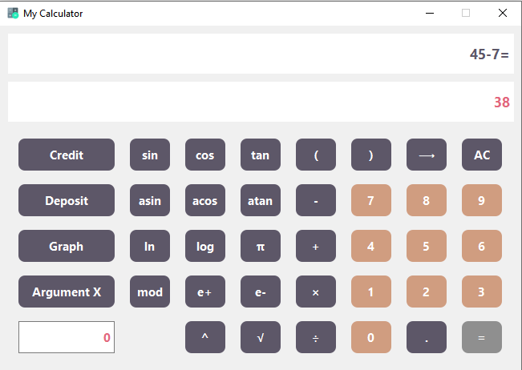
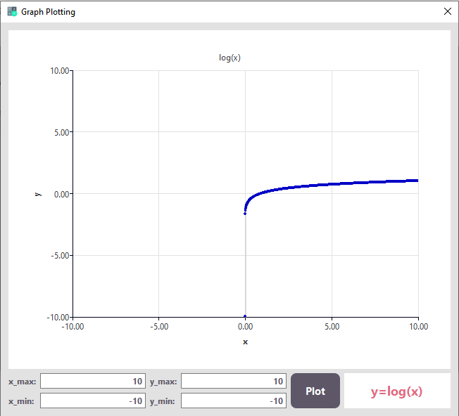
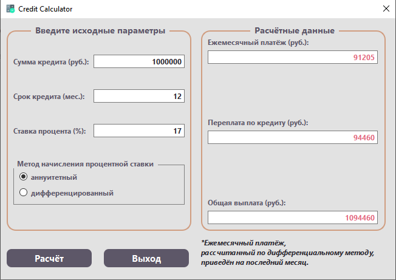
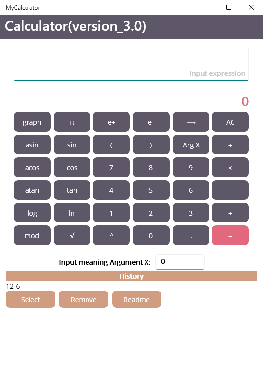
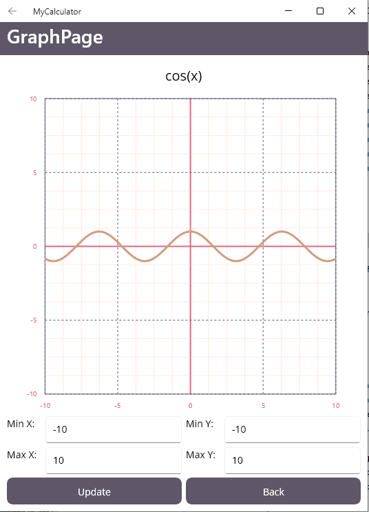
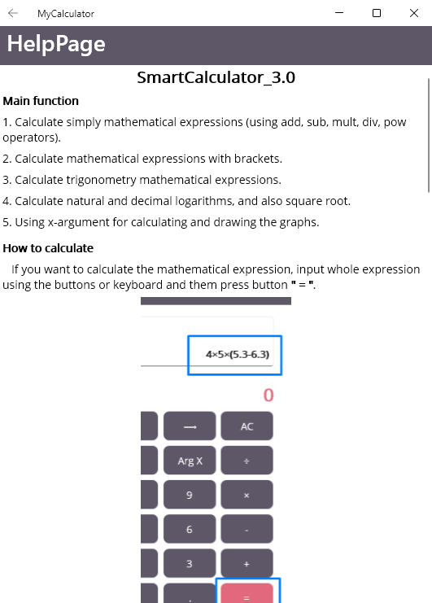
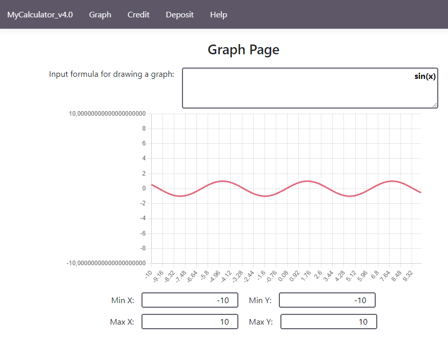
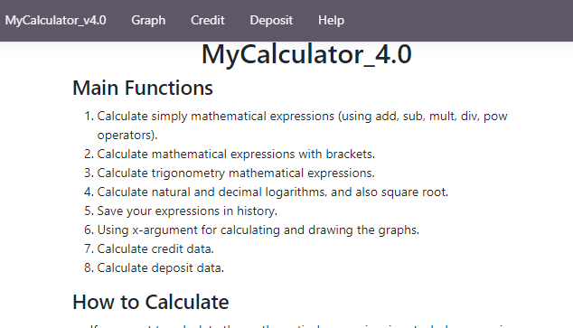
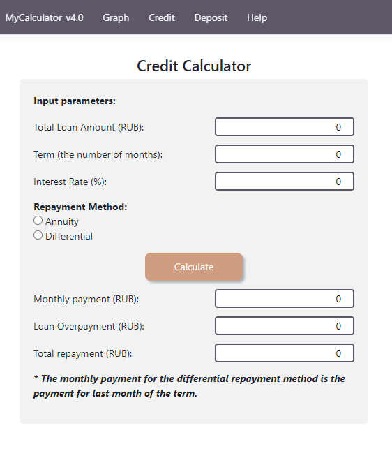
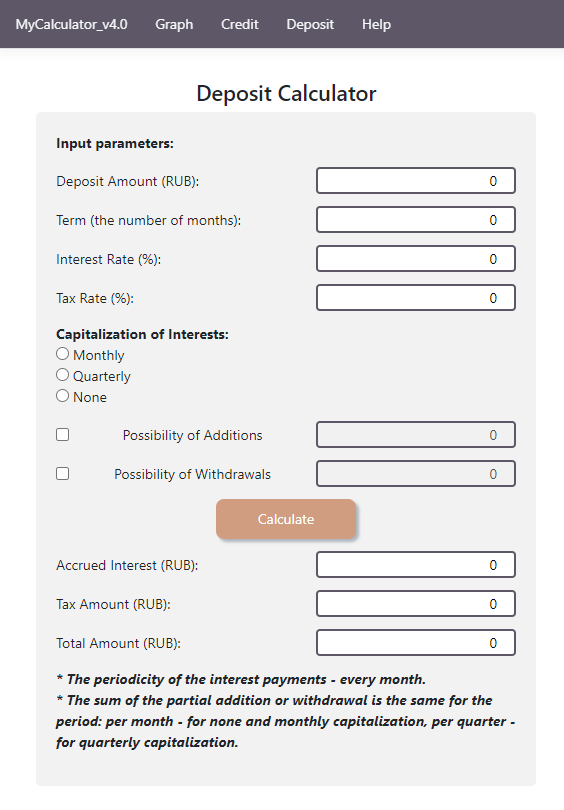

# PROJECT_CALCULATOR

The App helps to calculate long math expressions, draw charts of functions, estimate credit and deposit.

**There are 3 implementations of the application:**

**1.** [Desktop version (using QT, CPP)](#desktop-version-qt) \
**2.** [Desktop version (using .NET MAUI, C#, extern CPP Library)](#desktop-version-maui) \
**3.** [Web version (using ASP.NET MVC, extern CPP Library)](#web-version-aspnet)

**All implementations can:**

- calculate long bracketed arithmetic expressions in infix notation;
- calculate long bracketed arithmetic expressions in infix notation with substitution of x-variable as a number;
- calculate math expressions with the maximum length of 255 characters;
- calculate math expressions with the minimum accurancy of 7 decimal places;
- provide writing the numbers either via a point or in the exponential form;
- support the following arithmetic operations and mathematical functions:
  - addition **(+)**,
  - subtraction **(-)**,
  - multiplication (**x**),
  - division **(÷)**,
  - raising to the power **(^)**,
  - remainder of division (**mod**),
  - unary plus **(+)** and unary minus **(-)**,
  - cosine (**cos(x)**),
  - sine (**sin(x)**),
  - tangent (**tan(x)**),
  - arccosine (**acos(x)**),
  - arcsine (**asin(x)**),
  - arctangent (**atan(x)**),
  - square root **(√)**,
  - natural logarithm (**ln(x)**),
  - decimal logarithm (**log(x)**);
- plot the function defined using the x-variable math expression;
- plot the function in the additional displayed area, where it's available to change the limits of the function domain and the function range (**from -1 000 000 to 1 000 000 points**).

**QT desktop version and Web version also have modules for**:

- credit estimating (to be exact, the monthly payment, the overpayment for the loan, the total repayment);
- deposit estimating (to be exact, the accrued interest, the tax amount, the amount on deposit by the end of the term).

## <a id="desktop-version-qt">Desktop version (using QT, CPP)</a>

#### Source code directory: `./QT/`

#### Output App destination: `./QT/build*/MyCalculator.exe`

#### Software stack:

- C++17
- QT 6.2
- QT Creator 7.0.0
- Cmake

#### How to run on Windows

#### How to run on Mac or Linux

#### View of the App

1. Main window:
<p align="center">
  
</p>
2. Graph window:
<p align="center">
  
</p>
3. Help window:
<p align="center">
  
</p>
4. Credit window:
<p align="center">
  
</p>
5. Deposit window:
<p align="center">
  
</p>

## <a id="desktop-version-maui">Desktop version (using .NET MAUI, C#, extern CPP Library)</a>

#### Source code directory: `./MAUI/`

#### Output App destination: `./MAUI/MyCalculator_v3.0/bin/Debug/net8.0-<platform's configuration>/<platform's configuration>/publish/MyCalculator.exe`

#### Software stack:

- NET 8.0
- C# 12.0
- .NET MAUI
- C++17
- Visual Studio 2022
- Cmake

#### How to run on Windows

This version was tested on the **_Windows 10 (platform - x64)_**, but other platforms should also be available.

First of all, be sure that **_VCTargetsPath_** is set correctly to the last updated MSBuild Build Tools:

```
$Env:VCTargetsPath
```

If it isn't set or set to another way, update it by the following command:

```
setx VCTargetsPath "C:\Program Files\Microsoft Visual Studio\2022\Community\MSBuild\Microsoft\VC\v170\"
```

or through **_Windows Settings (About System -> Additional System Settings -> Environment Variables)_**.
\
\
\
Then go to the source directory and try to launch the App using `script_win.ps1` (here the CPP Library is built by **_MSBuild tools_**) or `sript_win_2.ps1` (here the CPP Library is built by **_Cmake tools_**).

If you are successfull, you'll find the published App in the **_output App destination_**.
\
\
\
If there are problems, try to run on the App by hands.

Fisrly, build the extern CPP Library:

```
msbuild .\ModelLibrary /p:Configuration=Release /p:Platform=<your platform>
```

Secondly, build the MyCalculator App:

```
dotnet publish .\MyCalculator_v3.0 -f <TargetFramework> -c Debug -p:RuntimeIdentifierOverride=<platform's configuration> -p:WindowsPackageType=None
```

\
Also you can debug or release the App using **_Visual Studio 2022_**. In this case you need to enable **_Developer Mode_** in your system.
Learn more about MAUI building [here](https://learn.microsoft.com/en-us/dotnet/maui/get-started/first-app).

#### How to run on MacOS

Try to launch `script_unix.sh` for running the App on MacOS.
\
In this script:

- **Target Framework** is **_net8.0-maccatalyst_**
- **Platform's Configuration** is **_maccatalyst-x64_**
  \
  If you have other parameters, please, change the corresponding variables in script-file (_$target_framework, $configuration_).

\
After the script will be successfully completed, you can find the App in the **_output App destination_**.

#### View of the App

1. Main window:
<p align="center">
  
</p>
2. Graph window:
<br>
<br>
<p align="center">
  
</p>
3. Help window:
<br>
<br>
<p align="center">
  
</p>

## <a id="web-version-aspnet">Web version (using ASP.NET MVC, extern CPP Library)</a>

#### Source code directory: `./ASP.NET_MVC/`

#### Output App destination: `./ASP.NET_MVC/bin/Debug/net8.0/MyCalculator_v4.0.exe`

#### Software stack:

- NET 8.0
- C# 12.0
- ASP.NET MVC
- C++17
- Visual Studio 2022
- Cmake

#### How to run on Windows
Go to the source directory and try to launch the App using `script_win.ps1`(here the CPP Library is built by **_Cmake tools_**).

If you are successfull, you see the link, which is used for App hosting.

For example:
```
http://localhost:<port number>
```
Follow this link in your browser in order to open the home page of the App. 

In **powershell7** you can use ***CTRL+link tab*** for opening the home page.
<br>
<br>
#### How to run on Mac or Linux
Go to the source directory and try to launch the App using `script_unix.sh`(here the CPP Library is built by **_Cmake tools_**).

If you are successfull, you see the link, which is used for App hosting.

For example:
```
http://localhost:<port number>
```
Follow this link in your browser in order to open the home page of the App. 

#### View of the App
1. Main window:
<p align="center">
  
</p>
2. Graph window:
<br>
<br>
<p align="center">
  
</p>
3. Help window:
<br>
<br>
<p align="center">
  
</p>
4. Credit window:
<br>
<br>
<p align="center">
  
</p>
5. Deposit window:
<br>
<br>
<p align="center">
  
</p>
