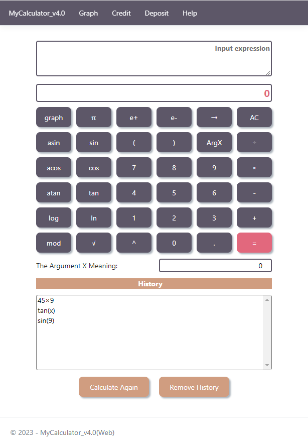

# PROJECT_CALCULATOR

The App helps to calculate long math expressions, draw charts of functions, estimate credit and deposit.

__There are 3 implementations of the application:__

__1.__ [Desktop version (using QT, CPP)](#desktop-version-qt) \
__2.__ [Desktop version (using .NET MAUI, C#, extern CPP Library)](#desktop-version-maui) \
__3.__ [Web version (using ASP.NET MVC, extern CPP Library)](#web-version-aspnet)

__All implementations can:__
- calculate long bracketed arithmetic expressions in infix notation;
- calculate long bracketed arithmetic expressions in infix notation with substitution of x-variable as a number;
- calculate math expressions with the maximum length of 255 characters;
- calculate math expressions with the minimum accurancy of 7 decimal places;
- provide writing the numbers either via a point or in the exponential form;
- support the following arithmetic operations and mathematical functions:
    - addition __(+)__,
    - subtraction __(-)__,
    - multiplication (__x__),
    - division __(÷)__,
    - raising to the power __(^)__,
    - remainder of division (__mod__),
    - unary plus __(+)__ and unary minus __(-)__,
    - cosine (__cos(x)__),
    - sine (__sin(x)__),
    - tangent (__tan(x)__),
    - arccosine (__acos(x)__),
    - arcsine (__asin(x)__),
    - arctangent (__atan(x)__),
    - square root __(√)__,
    - natural logarithm (__ln(x)__),
    - decimal logarithm (__log(x)__);
- plot the function defined using the x-variable math expression;
- plot the function in the additional displayed area, where it's available to change the limits of the function domain and the function range (__from -1 000 000  to 1 000 000 points__).

__QT desktop version and Web version also have modules for__:
- credit estimating (to be exact, the monthly payment, the overpayment for the loan, the total repayment);
- deposit estimating (to be exact, the  accrued interest, the tax amount, the amount on deposit by the end of the term).
  
## <a id="desktop-version-qt">Desktop version (using QT, CPP)</a>

#### Source code directory: `./QT/`

#### Output App destination: `./QT/`

#### Software stack:
- C++17
- QT 6.2
- QT Creator 7.0.0
- Cmake

#### How to run on Windows

#### How to run on Mac or Linux

#### View of the App
1. Main window:
<p align="center">
  
</p>
2. Graph window:
<p align="center">
  
</p> 
3. Help window:
<p align="center">
  
</p>   
4. Credit window:
<p align="center">
  
</p>
5. Deposit window:
<p align="center">
  
</p>
   
## <a id="desktop-version-maui">Desktop version (using .NET MAUI, C#, extern CPP Library)</a>

#### Source code directory: `./MAUI/`

#### Output App destination: `./MAUI/MyCalculator_v3.0/bin/Debug/net8.0-<platform's configuration>/<platform's configuration>/publish/MyCalculator.exe`

#### Software stack:
- NET 8.0
- C# 12.0
- .NET MAUI
- C++17
- Visual Studio 2022
- Cmake

#### How to run on Windows
This version was tested on the ***Windows 10 (platform - x64)***, but other platforms should also be available.


First of all, be sure that ***VCTargetsPath*** is set correctly to the last updated MSBuild Build Tools:
```
$Env:VCTargetsPath
```
If it isn't set or set to another way, update it by the following command:
```
setx VCTargetsPath "C:\Program Files\Microsoft Visual Studio\2022\Community\MSBuild\Microsoft\VC\v170\" 
```  
or through ***Windows Settings (About System -> Additional System Settings -> Environment Variables)***.
\
\
\
Then go to the source directory and try to launch the App using `script_win.ps1` (here the CPP Library is built by ***MSBuild tools***) or `sript_win_2.ps1` (here the CPP Library is built by ***Cmake tools***).

If you are successfull, you'll find the published App in the ***output App destination***.
\
\
\
If there are problems, try to run on the App by hands. 

Fisrly, build the extern CPP Library:
```
msbuild .\ModelLibrary /p:Configuration=Release /p:Platform=<your platform>
```

Secondly, build the MyCalculator App:
```
dotnet publish .\MyCalculator_v3.0 -f <TargetFramework> -c Debug -p:RuntimeIdentifierOverride=<platform's configuration> -p:WindowsPackageType=None
```
\
Also you can debug or release the App using ***Visual Studio 2022***. In this case you need to enable ***Developer Mode*** in your system.
Learn more about MAUI building [here](https://learn.microsoft.com/en-us/dotnet/maui/get-started/first-app).

#### How to run on MacOS
Try to launch `script_unix.sh` for running the App on MacOS.
\
In this script:
- **Target Framework** is ***net8.0-maccatalyst***
- **Platform's Configuration** is ***maccatalyst-x64***
\
If you have other parameters, please, change the corresponding variables in script-file (*$target_framework, $configuration*).

\
After the script will be successfully completed, you can find the App in the ***output App destination***.

#### View of the App
1. Main window:
<p align="center">
  
</p>  
2. Graph window:
<p align="center">
  
</p>   
3. Help window:
<p align="center">
  
</p>    
   
## <a id="web-version-aspnet">Web version (using ASP.NET MVC, extern CPP Library)</a>

#### Source code directory: `./ASP.NET_MVC/`

#### Output App destination: `./ASP.NET_MVC/`

#### Software stack:
- NET 8.0
- C# 12.0
- ASP.NET MVC
- C++17
- Visual Studio 2022
- Cmake

#### How to run on Windows

#### How to run on Mac or Linux

#### View of the App
1. Main window:
<p align="center">
  
</p>
2. Graph window:
<p align="center">
  
</p>   
3. Help window:
<p align="center">
  
</p>   
4. Credit window:
<p align="center">
  
</p>
5. Deposit window:
<p align="center">
  
</p>
   
